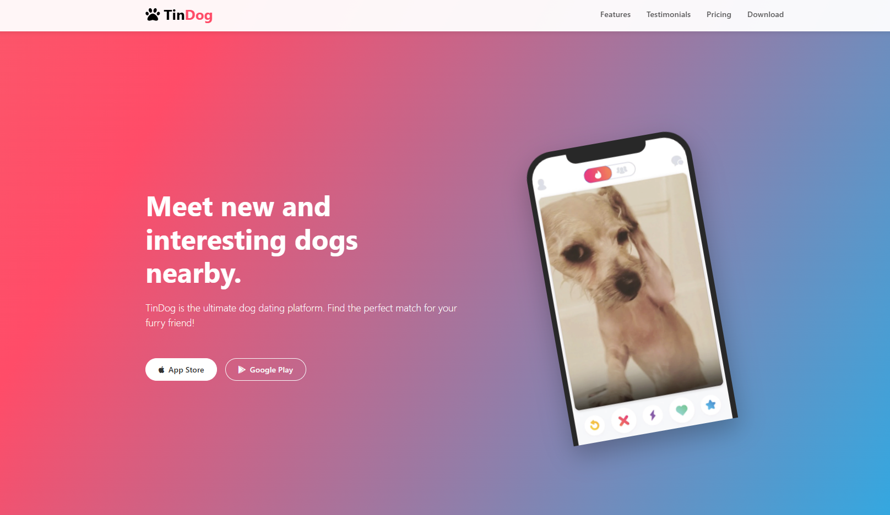

# TinDog - Dating App for Dogs

TinDog is a fun and engaging dating app designed exclusively for dogs. Whether your furry friend is looking for a playmate or a lifelong companion, TinDog makes it easy to find the perfect match.

## 🚀 Features
- **Easy to Use** - A simple and intuitive interface for effortless navigation.
- **Elite Clientele** - Only the best dogs are featured on our platform.
- **Guaranteed to Work** - Find the love of your dog's life or your money back.
- **Responsive Design** - Works seamlessly across all devices.
- **Bootstrap-Powered** - Modern and responsive UI with Bootstrap 5.

## 📷 Screenshots

## 🛠️ Technologies Used
- HTML5
- CSS3
- Bootstrap 5
- Font Awesome

## 📌 Sections
- **Hero Section**: Engaging introduction to the app.
- **Features**: Highlights the key benefits of using TinDog.
- **Testimonials**: Real user feedback from happy dog owners.
- **Pricing Plans**: Flexible plans for every dog’s needs.
- **Call to Action**: Encouraging users to download the app.

## 🌟 Contributing
We welcome contributions! Feel free to submit a pull request or open an issue for improvements.

## 📜 License
This project is licensed under the MIT License.

## 📞 Contact
For any inquiries, reach out at [your-email@example.com](mailto:your-email@example.com).

